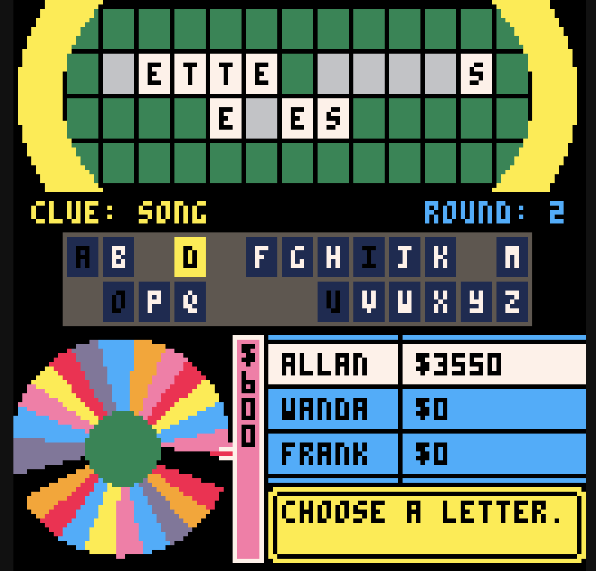
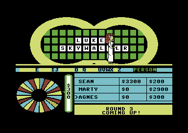

We Love Fortune for PICO-8
--------------------------

This is an homage to the Commodore 64 Wheel of Fortune game from the mid-80's.
It is built for the PICO-8 fantasy console.

# [Play it here!](https://www.lexaloffle.com/bbs/?tid=54845)

Note that the code is less-than-entirely clean due to much sacrifice in the name
of saving "tokens". To best emulate the 8-bit development experience, PICO-8 has
[arbitrary limitations](https://www.lexaloffle.com/dl/docs/pico-8_manual.html#Code_Limits).

### Screens
---------------

##### We Love Fortune - PICO-8 (2023)

##### Wheel of Fortune - Commodore 64 (1986)

